author: Angel Alberto Martinez Sanchez
summary: Resumen del CodeLab
id: docs
categories: codelab,markdown
environments: Web
status: Published

# INFORME DE ADQUISICION Y RECOLECCION DE EVIDENCIAS

## Recolección de Evidencias.

De acuerdo con la normativa ISO/IEC 27037, se debe garantizar que la recolección de evidencias se realice de manera que se preserve la integridad de los datos y se minimicen las alteraciones. A continuación, se describen los pasos seguidos en la recolección de cada tipo de evidencia durante el incidente.

### Identificación y Aislamiento de la Máquina Comprometida.

La máquina comprometida fue identificada mediante alertas del sistema de monitoreo. Una vez confirmada la posible intrusión, se procedió a desconectar físicamente la máquina de la red para evitar cualquier alteración de la evidencia o propagación del ataque.

### Creación de la Imagen del Disco.

Utilizando FTK Imager, se realizó una copia bit a bit del disco duro de la máquina comprometida. Este paso asegura que todos los datos presentes en el disco, incluidos los archivos eliminados y los metadatos, se preserven sin alteración. Se generaron y documentaron los hashes MD5 y SHA-256 para verificar la integridad de la imagen y garantizar que los datos no fueran modificados durante el proceso de adquisición.

Durante el proceso de creación de la imagen del disco, se tomaron capturas de pantalla que documentan cada paso del procedimiento y permiten revisar visualmente el proceso de adquisición:

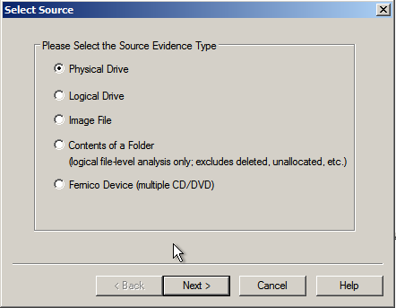

En la figura siguiente, se ilustra el primer paso del proceso. Una vez que hayamos seleccionado la opción "Crear una nueva imagen del disco" en el panel de la izquierda, deberemos desplegar el apartado denominado "**New**".

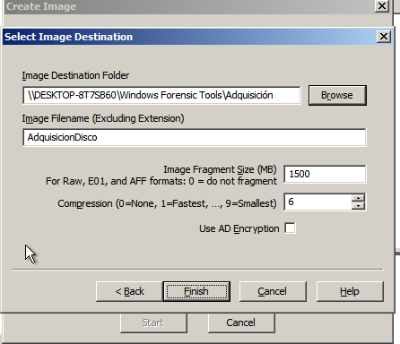

A continuación, se visualiza el lugar donde se desea almacenar la imagen del disco correspondiente.

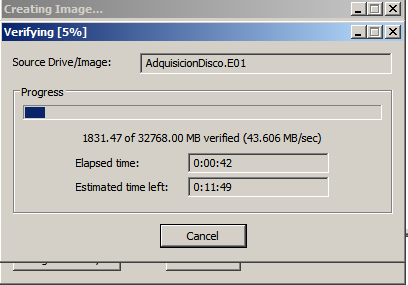

Una vez finalizada la creación de la imagen, se procederá a realizar la verificación correspondiente, previa a la generación del informe de los valores hash.
Para concluir, se presenta la visualización del informe que contiene los valores hash determinados.

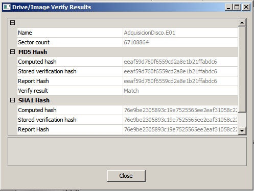

### Captura de Memoria RAM

Dado que la memoria RAM es volátil, se utilizó Ram Capturer para realizar una captura de la memoria activa de la máquina. La RAM contiene información crítica, como procesos activos, contraseñas y conexiones de red. Esta evidencia fue esencial para capturar información que de otro modo se perdería al apagar el sistema.

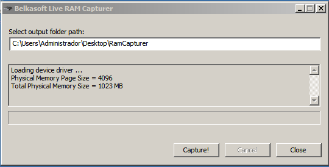

### Extracción de ARP (Protocolo de Resolución de Direcciones)

Se extrajeron las entradas ARP de la máquina comprometida para identificar la relación entre direcciones IP y MAC, lo que permite conocer los dispositivos en la red local con los que la máquina comprometida ha interactuado. Esta información es relevante para entender el alcance del ataque y posibles vectores de propagación.

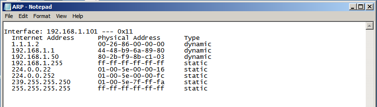

### Recolección de Archivos Temporales

Utilizando FTK Imager y otras herramientas de análisis forense, se recolectaron archivos temporales, que pueden contener fragmentos de datos críticos, como caché de navegador, registros de actividades o datos de aplicaciones recientes. Estos archivos temporales pueden ofrecer información valiosa sobre las acciones del atacante.

En primer lugar, seleccionamos dentro de la aplicación una nueva evidencia, y seleccionaremos la opción de elementos de una carpeta, una vez seleccionada podremos empezar a realizar nuestra adquisición.

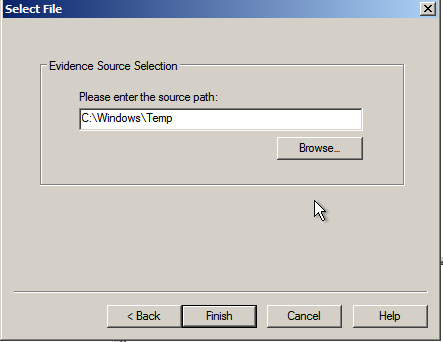

A continuación exportamos la imagen logical de la carpeta para tener información sobre los hashes:

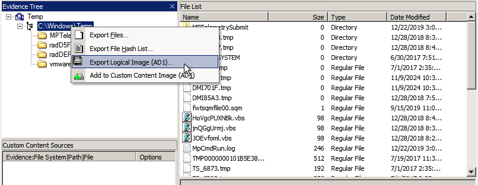

Resultado:

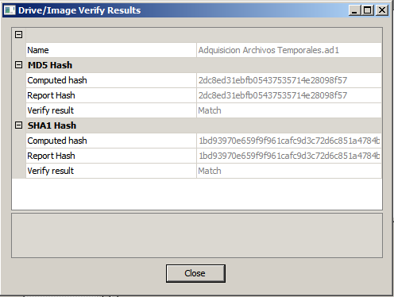

### Triaje de la Máquina.

Se realizó un triaje inicial para determinar el impacto del incidente. Durante esta fase, se analizaron los archivos y procesos activos, identificando posibles amenazas como malware o herramientas utilizadas por el atacante. El triaje permitió priorizar la recolección de evidencia más crítica para el análisis posterior.

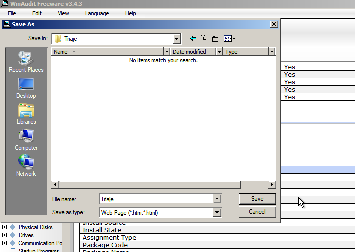

En la siguiente imagen vemos cómo guardamos un .html con toda la información del triaje más adelante habrá un enlace donde podremos ver todos los tipos de adquisiciones que se han hecho con las diversas herramientas.

### Recolección de Logs del Sistema

Se extrajeron los logs del sistema para obtener información sobre eventos importantes como accesos no autorizados, cambios en configuraciones y otras actividades sospechosas. Estos logs pueden proporcionar detalles sobre el tiempo y las acciones realizadas durante el ataque.

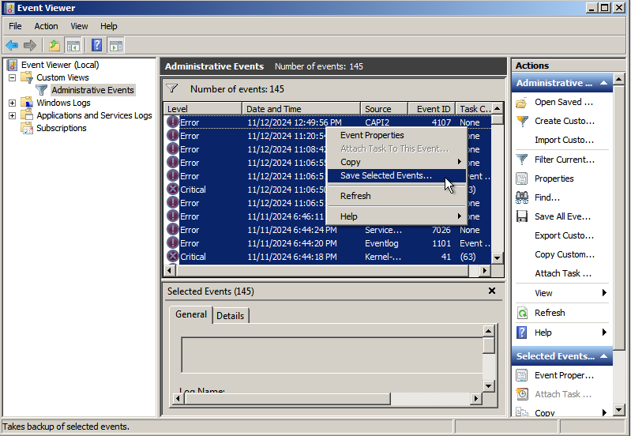

### Captura de Procesos Activos

Se recopiló una lista de todos los procesos activos en la máquina comprometida. Esta lista incluye tanto los procesos legítimos como cualquier proceso sospechoso que pudiera estar relacionado con el ataque. Identificar procesos maliciosos o desconocidos es crucial para entender el comportamiento del atacante y sus objetivos.

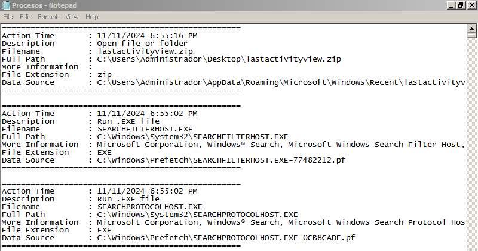

### Topología de red y Tabla de Enrutamiento

Se extrajeron detalles sobre la topología de la red y la tabla de enrutamiento de la máquina comprometida. Estos datos ayudan a entender cómo la máquina se conecta con otros dispositivos en la red y cómo se enrutan los paquetes. La tabla de enrutamiento muestra las rutas de comunicación de la máquina y permite identificar posibles rutas utilizadas por el atacante.

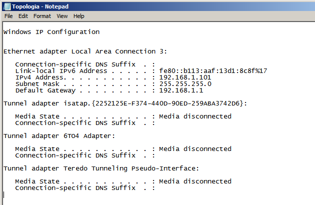

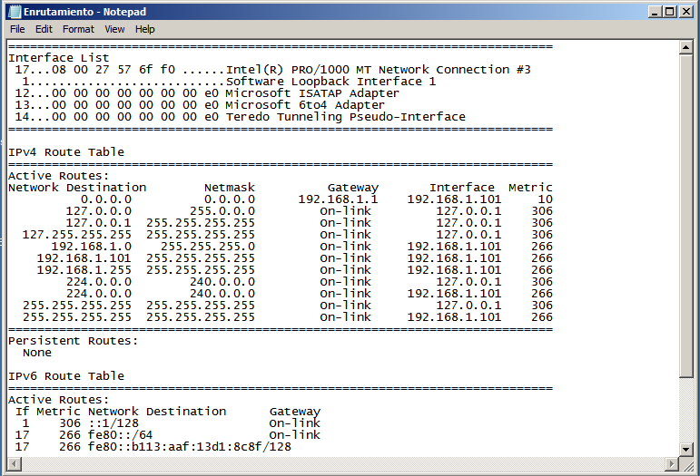

## Descripción de la Evidencia

A continuación se describe de manera detallada cada tipo de evidencia recolectada, su importancia y las características que hacen que cada una sea relevante en el análisis forense.

### Imagen del Disco

La imagen del disco contiene una copia exacta del disco duro de la máquina comprometida. Esta evidencia incluye todos los datos almacenados en el disco, tales como archivos de sistema, documentos, correos electrónicos, archivos eliminados y metadatos. Es esencial para un análisis forense exhaustivo, ya que permite investigar en profundidad sin riesgo de modificar el sistema original.

### Captura de memoria RAM

La memoria RAM contiene información crítica sobre los procesos en ejecución, contraseñas en memoria, sesiones activas y otros datos volátiles. Esta evidencia es clave para identificar actividades sospechosas en tiempo real y obtener información sobre las interacciones de la máquina comprometida con otros sistemas en la red.

### Entradas ARP

Las entradas ARP permiten asociar direcciones IP con direcciones MAC en la red local. Esta información es crucial para comprender cómo la máquina comprometida se comunica con otros dispositivos dentro de la red y puede ayudar a identificar dispositivos comprometidos o puntos de acceso no autorizados.

### Archivos Temporales

Los archivos temporales contienen fragmentos de datos de programas y aplicaciones que pueden haberse usado en el ataque. Estos archivos pueden incluir rastros de la actividad del atacante, como conexiones a sitios web maliciosos, herramientas utilizadas o datos transferidos durante el ataque.

### Triaje

El triaje realizado permite priorizar los datos más relevantes para el análisis forense. En esta fase, se identificaron procesos y archivos sospechosos, lo que ayudó a dirigir los esfuerzos de recolección hacia las áreas más críticas del sistema.

### Logs del Sistema

Los Logs del sistema contienen registros detallados de todas las acciones realizadas en la máquina, incluyendo accesos, cambios de configuración y errores del sistema. Son fundamentales para reconstruir la secuencia de eventos durante el ataque y comprender cómo se desarrolló el incidente.

### Procesos Activos

La lista de procesos activos muestra todos los programas y servicios en ejecución en la máquina. El análisis de estos procesos puede ayudar a identificar malware o herramientas utilizadas por el atacante para mantener el control sobre el sistema comprometido.

### Topología de Red y Tabla de Enrutamiento

La topología de la red y la tabla de enrutamiento proporcionan información sobre cómo la máquina comprometida interactúa con otros dispositivos en la red. Esto es esencial para comprender el alcance del ataque, los dispositivos involucrados y  posibles rutas de propagación.

## Cadena de Custodia

La cadena de custodia garantiza que la evidencia recolectada se maneje de manera segura y no se altere durante el proceso de adquisición, almacenamiento y análisis. A continuación, se presenta la cadena de custodia organizada en una tabla:

| Nº | Propósito de la Transferencia                              | Método de la Transferencia       | Fecha de la Transferencia | Nombre de la Persona que Entrega | Nombre de la Persona que Recibe |
|----|-----------------------------------------------------------|----------------------------------|---------------------------|----------------------------------|----------------------------------|
| 1  | Adquisición de la Imagen del Disco                        | USB externo cifrado              | 10/11/2024                | Ángel Martínez                   | Manuel Rivas                     |
| 2  | Captura de Memoria RAM                                    | USB externo cifrado              | 10/11/2024                | Ángel Martínez                   | Manuel Rivas                     |
| 3  | Recolección de Entradas ARP                               | USB externo cifrado              | 11/11/2024                | Ángel Martínez                   | Manuel Rivas                     |
| 4  | Recolección de Archivos Temporales                        | Transferencia de red segura      | 11/11/2024                | Ángel Martínez                   | Manuel Rivas                     |
| 5  | Triaje de la máquina                                      | Transferencia de red segura      | 11/11/2024                | Ángel Martínez                   | Manuel Rivas                     |
| 6  | Extracción de Logs del Sistema                             | Transferencia de red segura      | 12/11/2024                | Ángel Martínez                   | Manuel Rivas                     |
| 7  | Captura de Procesos Activos                               | Transferencia de red segura      | 12/11/2024                | Ángel Martínez                   | Manuel Rivas                     |
| 8  | Captura de la Topología de Red y Tabla de Enrutamiento   | Transferencia de red segura      | 13/11/2024                | Ángel Martínez                   | Manuel Rivas                     |

## Almacenamiento de la Evidencia

La evidencia fue almacenada siguiendo las directrices de la ISO/IEC 27037, asegurando su integridad y protección:

**Copia Principal**.

La evidencia fue almacenada en un servidor seguro y cifrado, con acceso restringido sólo al personal autorizado.

**Copia de Respaldo**.Se realizó una copia adicional de la evidencia en un dispositivo de almacenamiento externo cifrado, que fue almacenado en una ubicación física segura.

## Metodología Aplicada Según ISO/IEC 27037

La metodología seguida se basó en los principios establecidos por la ISO/IEC 27037, que incluyen:

*   **Identificación y Aislamiento**: La máquina comprometida fue identificada y desconectada de la red para evitar alteraciones.
    
*   **Recolección de Evidencias**: Se utilizaron herramientas forenses para recolectar imágenes del disco, memoria RAM, archivos temporales, logs, entre otros.
    
*   **Verificación de Integridad**: Se generaron los hashes de cada pieza de evidencia para garantizar su integridad.
    
*   **Almacenamiento Seguro**: La evidencia fue almacenada en un entorno seguro, con controles de acceso rigurosos.

## Enlace a las Evidencias en Repositorio

Una vez recolectadas y almacenadas, las evidencias fueron cargadas en un repositorio seguro para su análisis posterior. A continuación, se proporciona el enlace a la ubicación donde las evidencias pueden ser consultadas, con acceso restringido solo a personal autorizado.

[Enlace al Repositorio](https://drive.google.com/drive/folders/1jAmxf-Qgl9pt51fVO8ZDv7GpcbuI6kqD?usp=drive_link)

## Verificación de la Integridad de las Evidencias

Se llevó a cabo una verificación exhaustiva de la integridad de las evidencias mediante la comparación de los hashes generados antes y después de cada acción de recolección. No se encontraron alteraciones en ninguna de las evidencias.

## Conclusiones y Recomendaciones

El proceso de adquisición y recolección de evidencias se llevó a cabo conforme a la normativa ISO/IEC 27037, garantizando la integridad, seguridad y trazabilidad de las evidencias recolectadas. Se recomienda implementar un monitoreo continuo de la red, mejorar los procedimientos de respuesta a incidentes y reforzar la formación del personal involucrado en el análisis forense.

### Recomendaciones:

1.  **Revisión Continua**: Implementar monitoreo continuo para detectar actividades sospechosas en tiempo real.
    
2.  **Mejoras en la Respuesta a Incidentes**: Optimizar el proceso de triaje para garantizar una respuesta más eficaz.
    
3.  **Reforzamiento en la Seguridad de Almacenamiento**: Evaluar y mejorar las políticas de protección del repositorio de evidencia.
    
4.  **Entrenamiento Continuo**: Realizar sesiones de formación periódicas para el personal.